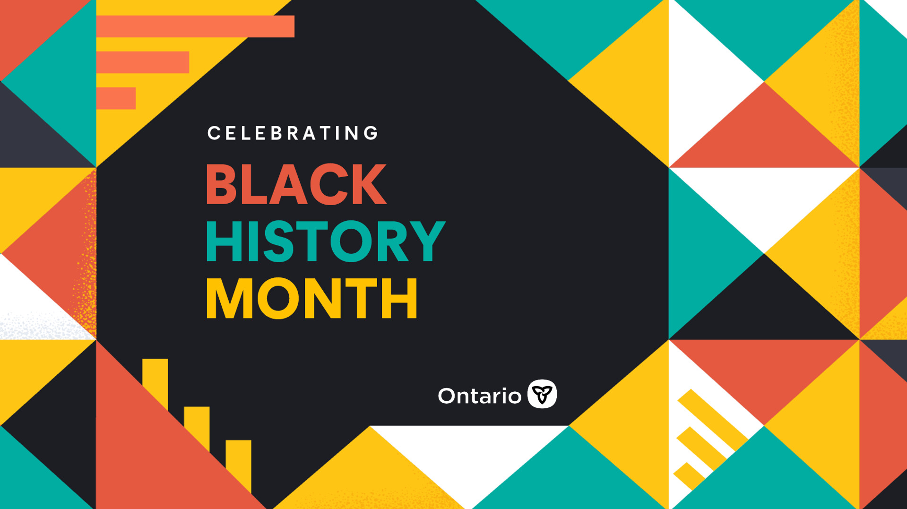
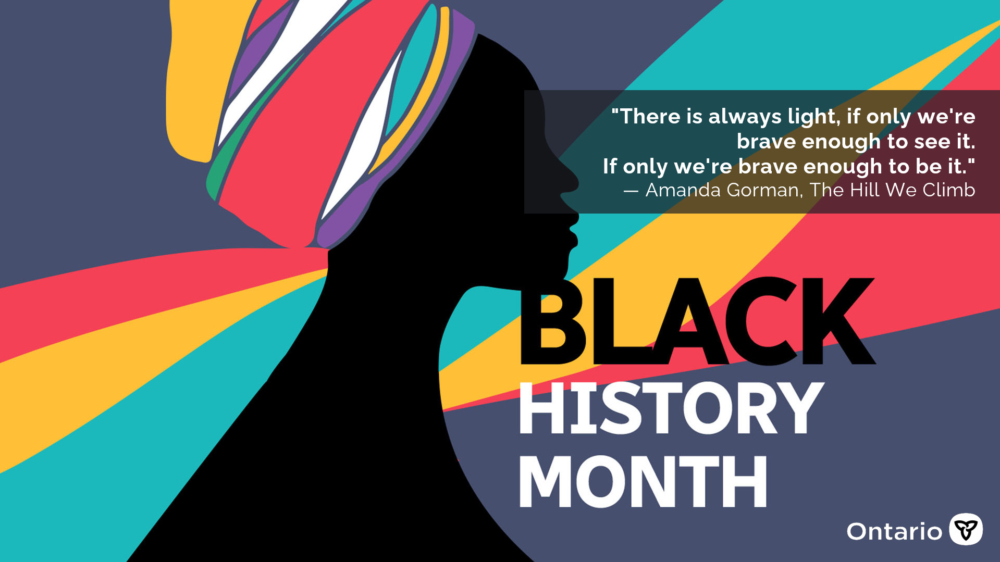

# Testing

Het I'm the sample markdown file showing off a lot functonality of a well formatted markdown document. I'll contain lots of different markdown utilities with 
some of them being very useful. I'll also contain some of the most basic markdown syntax. 
Like headers, code blocks, quotes, links, images, footers, tables, deletes/strikethorugh, table of contents, annnddddd, and I think that's it.
Oh right how could I forget emojis😁 and forward slash line breaks/

## A table of information

Please refer to [Mockaroo](https://www.mockaroo.com/) for excellent sample data generation

name|gender|race|address|grade
-|-|-|-|-
Gareth Crackel|Male|Thai|6 Fisk Trail|98.65
Shelley Lloyd|Male|American Indian|90 Everett Circle|6.36
Hinze Congram|Male|Panamanian|8637 Warrior Trail|61.56
Katharine Flook|Female|Yakama|38 Crest Line Alley|83.26
Caitlin Elletson|Female|Puerto Rican|65817 Blaine Point|27.5
Thea Lightwing|Female|Thai|6 Doe Crossing Crossing|87.18
Alejandra Bichard|Female|Cambodian|938 Clemons Plaza|40.16
Hallie Durrance|Female|Cree|07 Bayside Park|45.29
Lynett Mighele|Female|Central American|34 Rieder Alley|33.16
Wayland Scholling|Male|Iroquois|5 Bartillon Pass|16.14
Sabine Cheke|Female|Pakistani|1 Laurel Way|11.53
Diannne Dutnall|Female|Guamanian|936 Lotheville Court|49.83
Werner Danigel|Male|Micronesian|4 Muir Road|39.88
Brendon Dankersley|Male|Native Hawaiian and Other Pacific Islander (NHPI)|43497 Loomis Circle|61.33
Haroun Ryce|Non-binary|Taiwanese|84948 Dennis Center|1.73
Basile Greenrde|Male|Fijian|1 Bunker Hill Park|40.16
Bradford Danton|Male|Paraguayan|9 Jenna Pass|2.15
Nester Briskey|Male|Thai|2 Becker Place|49.58
Demetris Bennison|Male|Vietnamese|66 Clove Road|57.89
Ermin Alu|Male|Asian Indian|7 Dorton Way|66.52
Matti Divers|Female|Central American|0 Shopko Pass|15.94
Giselbert Ritmeier|Male|Asian|1 Vermont Drive|92.27
Krissie Flaonier|Female|Micronesian|3 Becker Plaza|41.35
Baldwin Jansen|Male|Dominican (Dominican Republic)|064 Fieldstone Hill|3.15
Devinne Hughland|Female|Bangladeshi|7977 Express Park|18.87

## Now for an aside of Black pride

### Images

### Poem